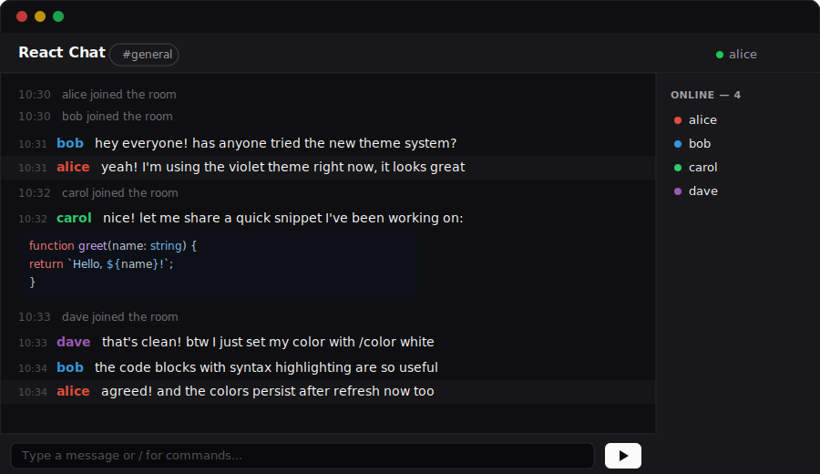

# React Chat

A real-time ephemeral chat application. No accounts, no message history — just instant WebSocket-powered conversation.



## Features

- **Ephemeral rooms** — create or join any room by name, messages exist only while the server is running
- **Real-time messaging** — WebSocket-based with automatic reconnection
- **Slash commands** — `/nick`, `/color`, `/pm`, `/giphy`, `/clear`, `/help`, and more
- **Code blocks** — share code with syntax highlighting via `` ```language `` fenced blocks or `!code`
- **Multiline messages** — Shift+Enter for newlines, Enter to send
- **Theme system** — 10 color themes (zinc, slate, rose, orange, green, blue, violet, yellow, red, cyan) with light/dark/system mode
- **Color persistence** — your chosen `/color` survives page refreshes
- **User sidebar** — see who's in the room with colored indicators
- **Private messages** — `/pm @user message` for direct messages
- **GIF support** — `/giphy query` to send animated GIFs
- **Nickname dialog** — optional nickname on join, saved to localStorage

## Tech Stack

- [React 19](https://react.dev) + [TypeScript](https://www.typescriptlang.org)
- [TanStack Start](https://tanstack.com/start) (full-stack framework)
- [TanStack Router](https://tanstack.com/router) (file-based routing)
- [Vite](https://vite.dev) (build tool)
- [Tailwind CSS v4](https://tailwindcss.com) + [shadcn/ui](https://ui.shadcn.com) (styling & components)
- [Radix UI](https://www.radix-ui.com) (accessible primitives)
- [highlight.js](https://highlightjs.org) (syntax highlighting)
- [Nitro](https://nitro.build) + [crossws](https://crossws.unjs.io) (server & WebSockets)
- [Biome](https://biomejs.dev) (linting & formatting)
- [Vitest](https://vitest.dev) (testing)

## Getting Started

```bash
bun install
bun run dev
```

The app runs at [http://localhost:3000](http://localhost:3000).

## Building for Production

```bash
bun run build
node .output/server/index.mjs
```

## Deploy to Railway

[](https://railway.com/template/new?repo=nearbycoder/react.chat&branch=main)

Or manually:

1. Connect your GitHub repo in the [Railway dashboard](https://railway.com)
2. Railway auto-detects the `railway.json` config
3. Set any environment variables (e.g. `GIPHY_API_KEY` if using `/giphy`)
4. Deploy — the app binds to Railway's `PORT` automatically

## Commands

| Command | Description |
|---------|-------------|
| `/nick <name>` | Change your nickname |
| `/color <color>` | Change your message color (any CSS color) |
| `/pm @user msg` | Send a private message |
| `/giphy <query>` | Send an animated GIF |
| `/list` | Refresh the user list |
| `/clear` | Clear your message history |
| `/help` | Show all commands |
| `` ```lang `` | Fenced code block with syntax highlighting |
| `!code <text>` | Inline code block |
